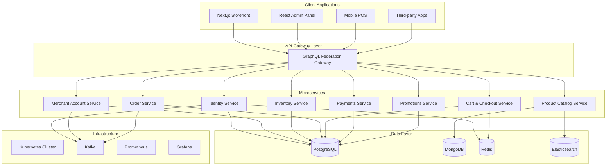
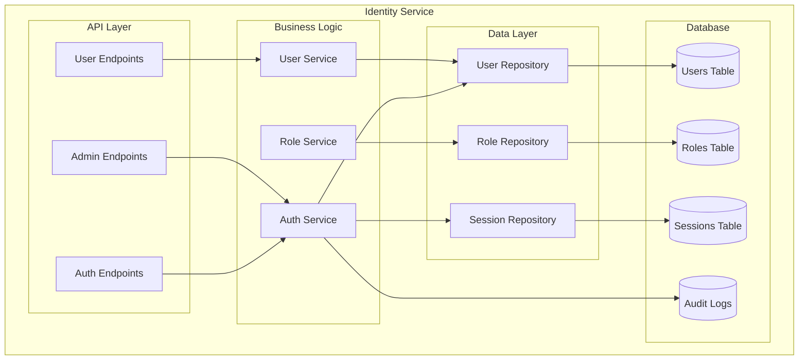
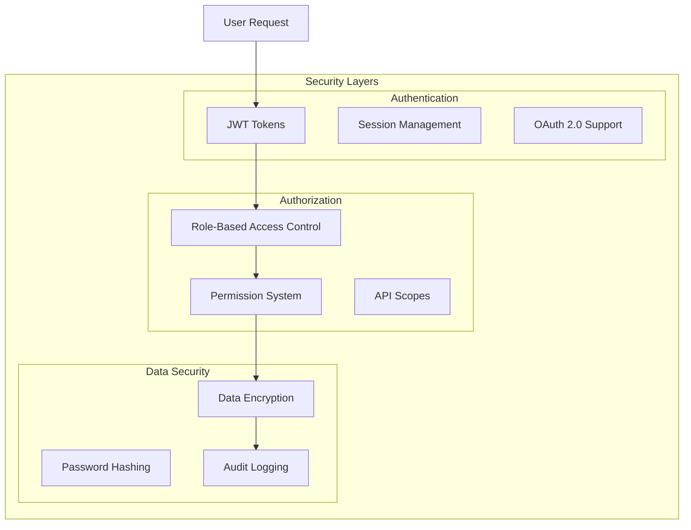
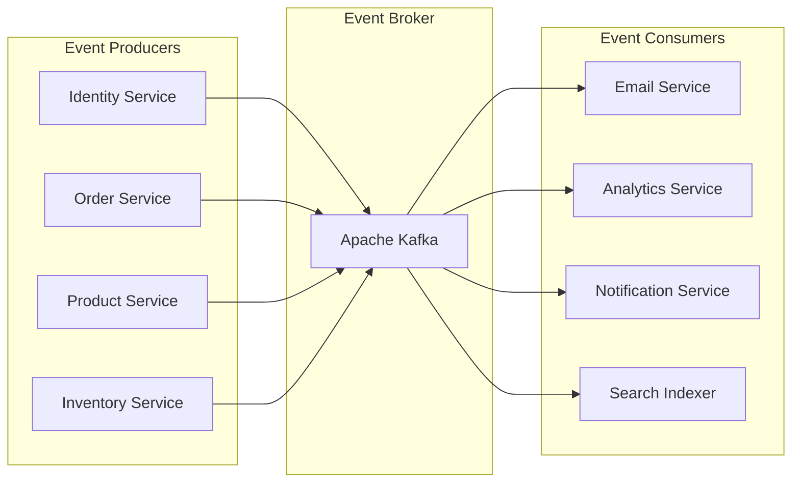
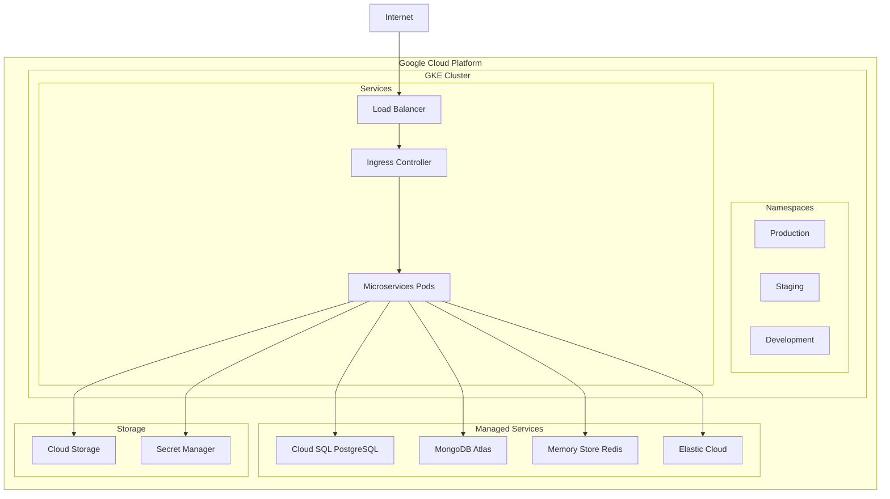
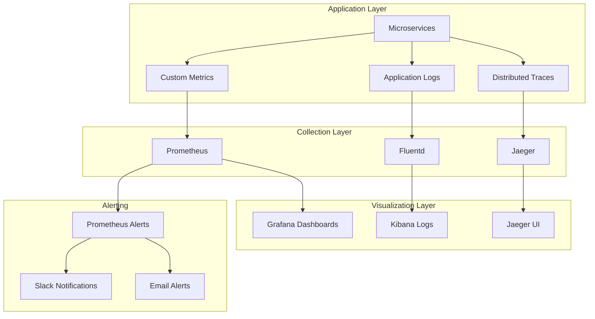

# Unified Commerce Platform Architecture

## System Overview

The Unified Commerce Platform is built as a microservices-based system designed to provide true unified commerce capabilities that surpass existing solutions.

## High-Level Architecture

## Core Services Architecture

### Identity Service (Implemented ✅)

## Data Architecture

### Database-per-Service Pattern

```mermaid
graph TB
    subgraph "PostgreSQL Databases"
        IDB[(Identity DB)]
        MDB[(Merchant DB)]
        INDB[(Inventory DB)]
        ODB[(Order DB)]
        CDB[(Cart DB)]
        PADB[(Payments DB)]
        PRDB[(Promotions DB)]
    end
    
    subgraph "MongoDB Databases"
        PCDB[(Product Catalog)]
    end
    
    subgraph "Redis Stores"
        CACHE[Cache Store]
        SESSIONS[Session Store]
        QUEUE[Message Queue]
    end
    
    subgraph "Elasticsearch"
        SEARCH[Product Search Index]
        ANALYTICS[Analytics Index]
    end
    
    IS[Identity Service] --> IDB
    MAS[Merchant Service] --> MDB
    INS[Inventory Service] --> INDB
    OS[Order Service] --> ODB
    CCS[Cart Service] --> CDB
    PS[Payment Service] --> PADB
    PRS[Promotion Service] --> PRDB
    
    PCS[Product Service] --> PCDB
    PCS --> SEARCH
    
    IS --> SESSIONS
    PCS --> CACHE
    OS --> QUEUE
```

## Technology Stack

### Backend Services
- **Language**: Go (Golang) 1.21+
- **Framework**: Gin HTTP framework
- **Databases**: PostgreSQL, MongoDB
- **Cache**: Redis
- **Search**: Elasticsearch
- **Messaging**: Apache Kafka

### Frontend Applications
- **Storefront**: Next.js (React) with SSR/SSG
- **Admin Panel**: React with TypeScript
- **Mobile POS**: React Native (planned)

### Infrastructure
- **Containerization**: Docker
- **Orchestration**: Kubernetes (GKE)
- **Monitoring**: Prometheus + Grafana
- **Tracing**: OpenTelemetry + Jaeger
- **CI/CD**: GitHub Actions (planned)

## Security Architecture

## Event-Driven Architecture

## Deployment Architecture

## Scalability Patterns

### Horizontal Scaling
- **Stateless Services**: All services designed to be stateless
- **Database Sharding**: Partition data across multiple databases
- **Caching Strategy**: Multi-level caching with Redis
- **CDN Integration**: Static asset delivery optimization

### Performance Optimization
- **Connection Pooling**: Database connection management
- **Async Processing**: Event-driven background tasks
- **Circuit Breakers**: Prevent cascading failures
- **Rate Limiting**: Protect against abuse

## Monitoring & Observability

## Key Architectural Principles

### 1. **Domain-Driven Design (DDD)**
- Services organized around business domains
- Clear bounded contexts and interfaces
- Event-driven communication between domains

### 2. **Database per Service**
- Each service owns its data
- Polyglot persistence (PostgreSQL, MongoDB, Redis)
- No direct database access between services

### 3. **API-First Design**
- GraphQL Federation for unified data access
- RESTful APIs for individual services
- Comprehensive OpenAPI documentation

### 4. **Cloud-Native Architecture**
- Containerized applications
- Kubernetes orchestration
- Auto-scaling and self-healing capabilities

### 5. **Security by Design**
- Zero-trust network model
- Encryption at rest and in transit
- Comprehensive audit logging

This architecture provides the foundation for a scalable, secure, and maintainable unified commerce platform that can compete with and surpass existing market leaders.